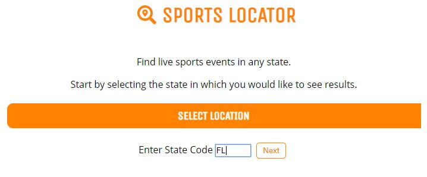
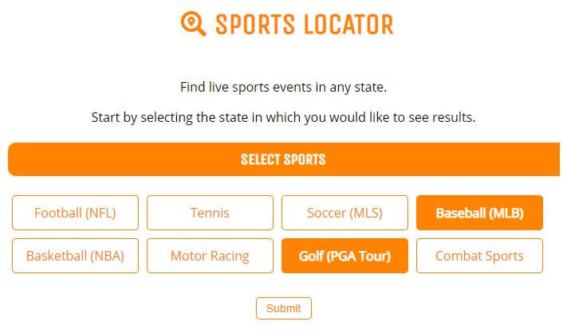
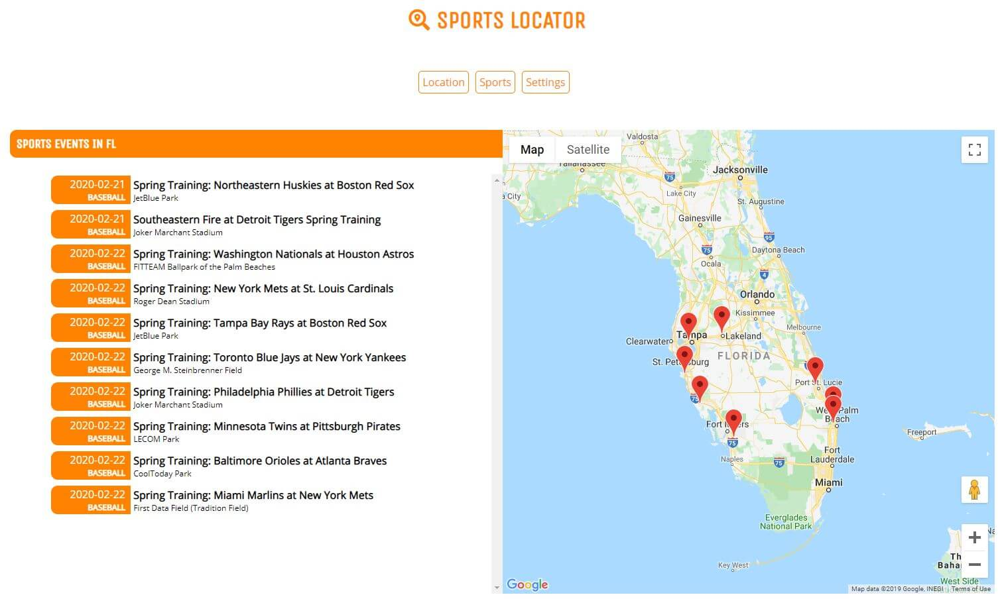
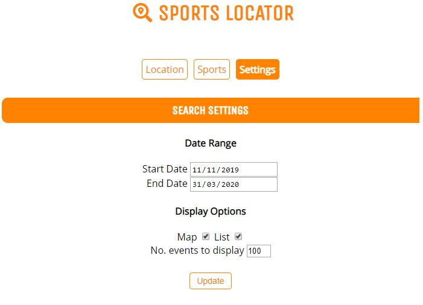

# Sports Event Locator App
This app allows users to find upcoming sports events in the state of their choice. 

## Summary
### What does the app do?
The app was created for those who may not be familiar with what sports events are available in other states. They will be able to do a quick search and see what is available for them to see in a specific state. Searches can also be filtered using the built in user options: 
- Date Range
- Number events to be displayed
- Map display mode
- List display mode
- State/Location Selection
- Sports Selection
### Technologies Used
This app makes use of the following technologies: HTML5, CCS3, javascript and jQuery

## Screenshots
### Welcome

### Sports Selection

### Display

### Search Settings

## Live Demo
[Sports Locator](https://goose39.github.io/sports-event-locator/)